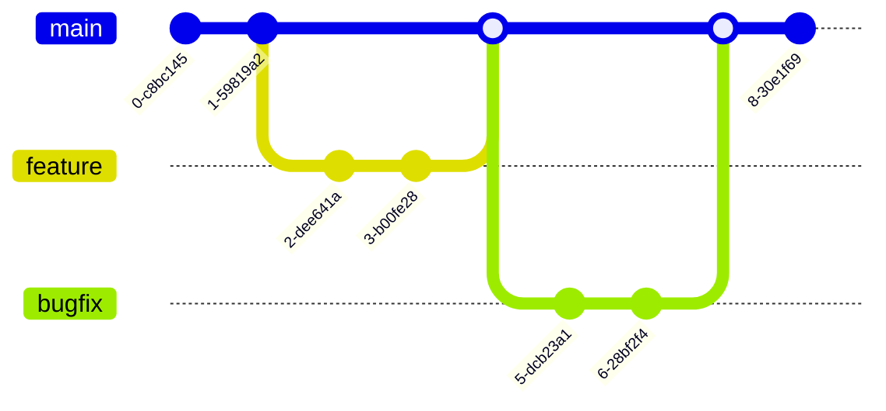

# Contributing to Giro3D

:heart: Thanks for helping the Giro3D project!

[[_TOC_]]

## 🏅 Getting Started Contributing

Everyone is welcome to contribute to Giro3D!

In addition to contributing to core Giro3D code, we appreciate many types of contributions:

-   Being active on issues, MR and other communication channel.
-   Showcasing your application built with Giro3D: submit an issue with a link to your demo on the project issue tracker.
-   Writing tutorials, creating examples, and improving the reference documentation.
-   Submitting issues as [described below](#-submitting-an-issue).
-   Triaging issues. Browse the [issues](https://gitlab.com/giro3d/giro3d/-/issues) and comment on issues that are no longer reproducible or on issues for which you have additional information.

### 🎫 Good first issue

Browse the [issues](https://gitlab.com/giro3d/giro3d/-/issues) and search for the [`good first issue`](https://gitlab.com/giro3d/giro3d/-/issues/?sort=created_date&state=opened&type%5B%5D=issue&or%5Blabel_name%5D%5B%5D=good%20first%20issue&first_page_size=20) label, indicating a low-effort issue that is suitable to a newcomer.

### 💬 Submitting an Issue

If you think you've found a bug in Giro3D, first search the [issues](https://gitlab.com/giro3d/giro3d/-/issues). If an issue already exists, you can add a comment with any additional information. Use reactions (not comments) to express your interest. This helps prioritize issues.

If a related issue does not exist, submit a new one. Please include as much of the following information as is relevant:

-   Sample data to reproduce the issue
-   Screenshot, video or animated .gif if appropriate. Screenshots are particularly useful for exceptions and rendering artifacts. If it is a rendering artifact, also include the output of [webglreport.com](http://webglreport.com/) for the computer you have the problem on
-   Your operating system and version, browser and version, and video card. Are they all up-to-date? Is the issue specific to one of them?
-   The exact version of Giro3D. Did this work in a previous version?
-   Ideas for how to fix or workaround the issue. Also mention if you are willing to help fix it. If so, the Giro3D team can often provide guidance and the issue may get fixed more quickly with your help

You don't need to bother with the metadata of the issue (assignees, labels, etc) if you are unsure about them, they will be added later on by other contributors.

### 💻️ Code changes

Any changes, to the code, the documentation or anything else, by any contributor, are more than welcomed!

Ideally, any code change starts with an issue, so if you plan to work on something, feel free to first open an Issue to get early feedback and support. If an issue already exists and is unassigned, you can self-assign it to you and start from there. If the issue is already assigned to someone, please reach out with the assignee to make sure any of two don't waste time: the assignee indicates who is (actively) working on is to make it progress.

To be able to do some changes, you must first [fork the project](https://gitlab.com/giro3d/giro3d/-/forks/new) and open a merge request as detailed in the next section.

#### Development process

As this repository serves both [Giro3D npm package](https://www.npmjs.com/package/@giro3d/giro3d) and [the whole website](https://giro3d.org/), knowing what NPM tasks to run is not that straightforward. If you're modifying Giro3D code, chances are you'll just need `npm start` to get started and launch the examples, and `npm test` to execute the lints and tests.

Here's a cheatsheet on what to do :

| What I am editing ?                            | What should I run to build the changes                                                                                                                                         | What should I run to test my changes                             |
| ---------------------------------------------- | ------------------------------------------------------------------------------------------------------------------------------------------------------------------------------ | ---------------------------------------------------------------- |
| Examples                                       | Run the examples: `npm start` (VSCode: "Run Build Task" or task `Build and run`)                                                                                               | Run the tests: `npm test`                                        |
| Internal code (no API changes)                 | Run the examples: `npm start` (VSCode: "Run Build Task" or task `Build and run`)                                                                                               | Run the tests: `npm test`                                        |
| API documentation (no code change)             | See the generated API documentation: `npm run serve-apidoc` (VSCode: Task `Serve API doc`)                                                                                     | Run the tests: `npm test` Run only the linter: `npm run lint` |
| Public code with API changes                   | Run the examples: `npm start` (VSCode: "Run Build Task" or task `Build and run`) See the generated API documentation: `npm run serve-apidoc` (VSCode: Task `Serve API doc`) | Run the tests: `npm test`                                        |
| Website                                        | See the generated site: `npm run serve-site` (VSCode: Task `Serve site`)                                                                                                       | N/A                                                              |
| Code that I want to use in an external project | Generate the npm tarball: `npm run make-package` (VSCode: Task `Generate package`)                                                                                             | N/A                                                              |

### 🚀 Opening a Merge Request (MR)

We welcome merge requests (MRs) with great interest. We try to promptly review them, provide feedback, and merge. Following the tips in this guide will help your merge request be merged quickly.

-   If you plan to make a major change, please open an issue first.
-   If this is your first contribution to Giro3D, add your name to [CONTRIBUTORS.md](CONTRIBUTORS.md)
-   If your merge request fixes an existing issue, include a link to the issue in the description.
-   If your merge request needs additional work, include a task list, or better, split it in several MRs
-   Ping `@giro3d` in the comments to get your code reviewed, and also when you are done making new commits to address feedback
-   Verify your code passes the linter and tests (`npm test`).
-   If you added new identifiers to the Giro3D API:
    -   Include reference documentation with code examples
    -   If your change adds significant features, provide a demo
-   Write commit message that follow the [Angular convention](https://github.com/angular/angular/blob/main/CONTRIBUTING.md#-commit-message-format). To help you doing so, you can use the `commitizen` CLI to write commit messages (use the `git cz` command instead of `git commit`). Alternatively, you can set [git hooks](https://github.com/commitizen/cz-cli#optional-running-commitizen-on-git-commit) and use the `git commit` command.
-   Keep the git history clean, rebase your work when necessary
-   Delete unused and obsolete branches

## Advanced contribution guide

### Triaging issues

Any contributor is welcomed to help triaging existing issues, but requires a bit of understanding of Giro3D internals.

Triaging consists mainly in settings labels. Labels provide a clear view on what an issue is about. There are multiple categories of labels:

-   What the issue is - all issues should have one among these:
    | Label | Description | Typical use case | Example |
    |-------|-------------|------------------|---------|
    | ~"type::bug" | a behavior is unexpected | "xxx doesn't work" | #286 |
    | ~"type::feature" | a feature that does not exist, or extending a feature that already exists | "I'd like tu support xxx use case which is not possible currently" | #247 |
    | ~"type::refactor" | a code change that does not fix any bug or add any feature | "xxx should be rewritten for clarity" | #130 |
    | ~"type::support" | a question, or unclear if bug or not | "I don't know if xxx is expected or not" | #89 |
    | ~"type::discussion" | ask for a discussion, doesn't necessarily imply a code change, or might lead to the creation of other issues | "should we do xxx?" | #264 |

-   What the issue impacts - all issues should have at least one among these:
    | Label | Description |
    |-------|-------------|
    | ~"build" | About the build/packaging system, not the code itself - _may_ impact the API |
    | ~"documentation" | Documentation of Giro3D, including the website |
    | ~"example" | Examples provided on the website |

    TODO:

    -   add "API" to easily know what impacts the public API
    -   add relevant areas/modules: "Map", "Controls", "Sources", "Core", etc.

-   Other metadata:
    | Label | Description |
    |-------|-------------|
    | ~"critical" | Usually for a bug, should be resolved in next release |
    | ~"good first issue" | A beginner friendly issue that can be solved by new contributors |
    | ~"perf" | Affects performances |

-   Internal scoped-labels may be added by contributors who own them:
    | Label | Owner |
    |-------|-------|
    | ~"R&D::XXXX" | Oslandia |
    | ~"project::XXXX" | Oslandia |

### Merge Requests guidelines

First of all, committers should lead by example, and create issues before any code change (well, maybe not for typos...), and start branches within this repository, by using the "create merge request and branch" button from the issue.

In order to smooth interactions, a few rules to help identify who should do what during a review process:

-   A MR that needs additional work, e.g. not ready to be merged, should be in "Draft" mode to easily clearly identify what's ready to be reviewed and what's not; the author of the MR is responsible for managing the state of his MR
-   The author can explicitly add reviewers to request a review from them - reviewers can be any users (not necessarily contributors nor committers)
    -   If no committer is added explicitly, the author should ping `@giro3d` for review. That will notify all committers, who will then add themselves as reviewers
-   Any contributor can add additional reviewers at any stage of the MR
-   The assignee is the person responsible for the next action related to the MR:
    -   At creation, the author of the MR must self-assign it to themselves,
    -   During review, it should still be the author of the MR,
    -   When review is done (approved) and no work is left, the author assigns it to a committer (or asks in the MR if any reviewer wants to take over) to signal it's ready to be merged

#### Reviewing Merge Requests

Any user can participate in any merge request, even if not explicitly mentioned in the reviewers.

Users can review a MR when it is ready, but also while it's in Draft state, to provide early feedback. However, while a MR is in Draft state, reviewers should not be expected to perform any review, except if the author explicitly asks for one in the MR discussion.

Reviewers are encouraged to approve a MR if and only if they think a MR is ready to be merged as-is, meaning there is no work left from the author. This way we can easily identify which MRs can safely be merged and which need attention.

While a MR has unresolved threads, committers cannot merge it: all threads must be marked as resolved at some point. If a thread is trivial enough, the author can resolve it himself; otherwise it should be resolved by the reviewer - the author should ping the reviewer when changes were made to request a new review.

Note that resolving a thread can involve the creation of another issue and be dealt with it later on: please then mention the new issue in a comment when resolving the thread.

#### Merging Merge Requests

A Merge Request should be merged by its assignee once review is fully done. We leave it to the appreciation of the assignee to decide how many reviewers and committers should approve additionnally the MR. As a rule of thumb, if a MR impacts the architecture or the API, multiple approvals are required, whereas a typo in the documentation can be merged with only one approval.

Before merging, the assignee must first:

-   ensure labels are properly set on the corresponding issue (or on the MR if there's no issue)
-   ensure milestone is properly set to the next version on the corresponding issue (or on the MR if there's no issue)

### Git workflow

During regular development, we follow a simple [feature branch workflow](https://www.atlassian.com/git/tutorials/comparing-workflows/feature-branch-workflow), with feature or bugfix branches starting from the (latest) `main` branch. No commits should be done directly on `main`, only merges from Merge Requests via GitLab.

When forking Giro3D, we encourage using the same branch workflow, instead of working directly on `main`. This will simplify pulling upstream changes from our repo to your fork, and will let you open multiple MRs if you have multiple unrelated contributions to make.

For releases, we have a simplified [Gitflow workflow](https://www.atlassian.com/git/tutorials/comparing-workflows/gitflow-workflow) (there's no `develop` branch). Once a release branch is started, fixes for that release are done in branches, starting from the release branch, and merged via Merge Requests into the release branch. Once the release is ready:

-   if no additional feature got merged into `main` in the meantime, it is merged back into `main` and tagged from there;
-   otherwise, it is merged back into `main`, but the tag is generated from the release branch.

Hotfixes on releases (e.g. `vX.Y.1`) are done following the same principle:

1. branch from the release branch,
2. merge it back into the release branch,
3. merge the release branch into `main`
4. tag from the release branch.

### Releasing Giro3D

Any committer can perform a release, following the [How to release](HOW_TO_RELEASE.md) procedure.

Any release should be discussed by committers, upfront or during the MR to create the release.
